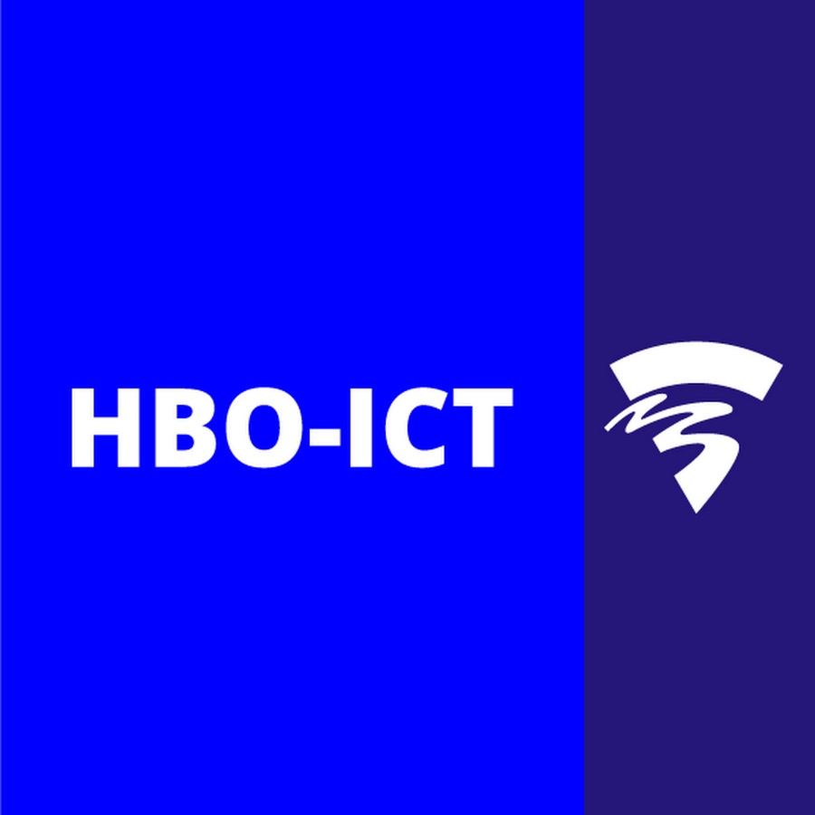

# Propedeuse-opdracht 2023-2024 Cyber Security blok 1 - Secret Manager

## Hoe is deze repository ingericht 🔠

Bovenstaande broncode is een eerste opzet van de Secret Manager. Je gaat tijdens de opdracht voortbouwen op deze broncode, aan de hand van de al geschreven user stories.

📄 In de folder docs vind je de technische documentatie die een student schrijft. Hier is een voorbeeld van een opdracht van een GD-student opgenomen die in de propedeuse 2022-2023 zit.

In dit bestand(readme.md) vind je algemene informatie over de repository, zoals hoe je deze kunt gebruiken. Daaronder is informatie gerelateerd tot techniek te vinden 🛠.
Onder de pagina Issues > Boards (te vinden via de balk links 👈🏽) vind je verschillende boards:

Learning stories;
Product backlog;
Sprint 1 backlog(4 - 17 september);
Sprint 2 backlog(18 september - 18 oktober);
Sprint 3 backlog(9 oktober - 5 november);

Op de wiki (ook te vinden via de balk links👈🏽) vind je de opdrachtomschrijving. Er komt ook een kopie in de docs folder.
Op Gitlab pages wordt een static site gedeployed elke keer als je commit.

## Techniek specifiek voor CS-opdracht

### Benodigde programma's

#### Terminal (MacOS) of Powershell (Windows)

Staat standaard all geinstalleerd

Als tijdens deze handleiding gevraagd wordt om een commando uit te voeren dan type of kopieer je het commando naar de terminal omgeving en druk je vervolgens op enter.

#### Python

Python is de programmeertaal die jullie gaan gebruiken.

#### Visual Studio Code (VSCode)

VSCode is de ontwikkelomgeving die jullie gaan gebruiken om de projecten mee te gaan ontwikkelen.

#### Docker

Docker is een container platform waarop jullie applicatie gaat draaien.

Jouw website draait in een Docker-container. Deze omgeving ga je in de loop van het jaar vaker gebruiken voor andere CS-opdrachten. Je hoeft voor de eerste opdracht niks aan te passen aan de instellingen van deze omgeving. In de handleiding "Docker starten" staat beschreven hoe de Docker-omgeving is opgebouwd, en waar jij aan de slag kan. 

#### Git

Git is een versiebeheer systeem. Dit gebruiken we om met een groep mensen software te kunnen ontwikkelen en beheren.

#### Homebrew [MacOS]

[Homebrew](https://brew.sh/) is een packagemanager voor MacOS. Hiermee kunnen we allerlei software installeren en up to date houden. Voor nu gebruiken we het alleen om git te installeren.

### Installatie Handleiding

Om alles goed te kunnen installeren en klaar te zetten om aan het project te beginnen volg je de [Installatie Handleiding](docs/getting-started/installation.md)

### Project starten

Om het project te starten gaan je de terminal binnen vscode gebruiken. Start deze via de command palette (zie installatie handleiding) met "View: Toggle Terminal" of via de snelkoppeling.

#### Alleen Webserver

Voordat we database nodig hebben kan je het project nog prima docker runnen.
1. controleer dat de virtual environment actief is, dit zou het geval moeten zijn na de installatiehandleiding.
    - (.venv) zal dan te zien zijn op de commandline interface.
    - je kan deze handmatig activeren doormiddel van `".venv/Scripts/activate"`
2. navigeer naar de webapp directory door middel van het commando `cd webapp`
3. voer uit: `flask --app secretsapp run`
4. volg de gegeven link naar de browser

#### Webserver + Database

Voor het draaien van de docker omgeving moeten we weer in de root directory zijn in de terminal. Als je nog in de "webapp" directory zit na de webserver only optie dan kan je met het commando `cd ..` terug naar de root directory.
1. controleer dat de docker desktop applicatie is gestart.
2. voer uit: `docker-compose up --build`. Dit kan even duren.
